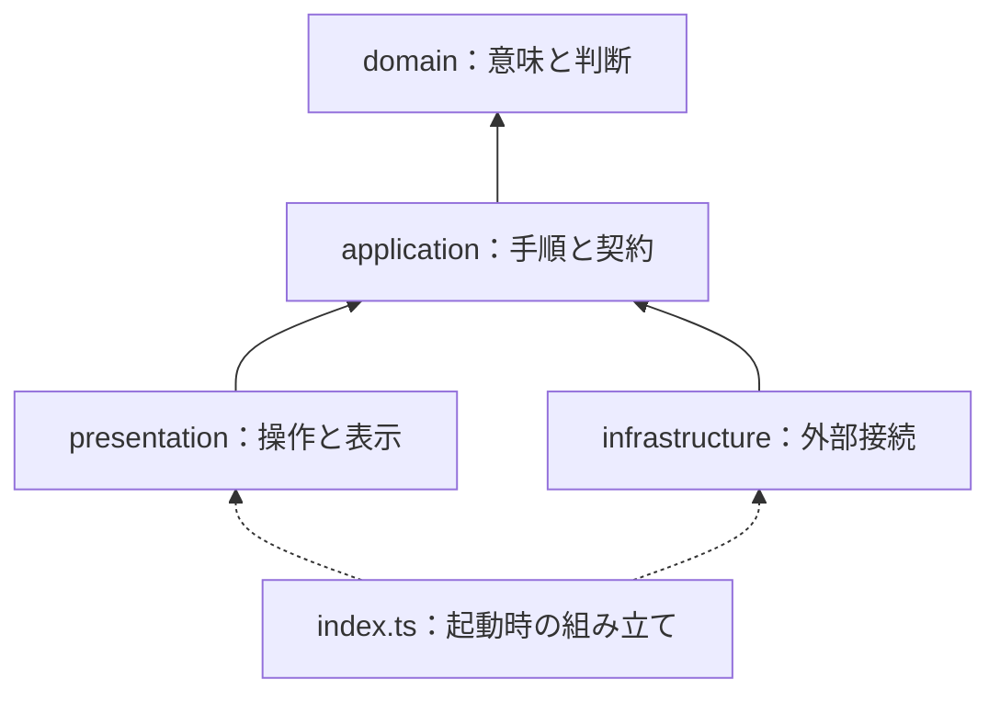

# Architecture

Three components share **one configuration source (TOML) and one service
catalog (PHP service classes)**.


## Two sources of truth

| Source | Location | Generated outputs |
|---|---|---|
| Configuration: what, where, and how to display | `share_config.toml` | `share.json` for the plugin; `generated/defaults.ts` for JavaScript |
| Services: SVG logos, brand colors, and where to send which fields | `plugin/src/Service/*.php` | `generated/catalog.ts` for JavaScript |

The generator reads PHP classes with regular expressions and extracts `key()`,
`label()`, `brandColor()`, `icon()`, `action()`, `endpoint()`, and `params()`.
Those classes are definitions: they state where to send and which fields to send,
and are never loaded at runtime. **Share URLs are built in one place, the Web
Component.** PHP changes flow into JavaScript on the next build; `--check` detects drift.

## PHP plugin: layered architecture and SOLID

```text
plugin/
  promari-sns-share.php          Bootstrap: requires and the promari_sns_share() template tag
  src/Domain/Placement       Where the element may appear
  src/Contracts/             ConfigInterface (runtime), ServiceInterface (definitions only)
  src/Config/JsonConfig      Reads generated configuration and fails closed
  src/Service/               One final class per service: logo, color, endpoint, and fields.
                             Read by tools/config.py; not loaded at runtime
  src/Integration/Widget     WordPress sidebar widget
  src/Plugin.php             Decides placement, emits <promari-sns-share>, loads the bundle
```

| Principle | Application |
|---|---|
| **S**: single responsibility | Separate configuration loading, URL construction, formatting, rendering, and wiring |
| **O**: open / closed | Add a `ServiceInterface` implementation and register it through `promari_sns_share_services` |
| **L**: substitution | Renderers rely on the six-method service contract, not concrete service classes |
| **I**: interface segregation | Themes use the template tag or shortcode without knowing renderer internals |
| **D**: dependency inversion | Rendering and formatting depend on `ConfigInterface`, not the JSON representation |

The plugin uses PHP 8.1 features: strict types, readonly properties, enums,
`match`, named arguments, first-class callables, and `array_map` / `array_filter`
pipelines.

## Web Components：依存方向を検査する四層

共有URLの組み立ては、この四層だけが行う。PHP側は「どこへ、どの項目を送るか」を
定義として持ち、実行時にURLを作らない。2.0.0でサーバー描画を廃止したためで、
同じ処理を二か所に持たないぶん、両者の一致を確かめる必要もなくなった。

```text
web/src/
  domain/          共有内容・操作・サービス選択・URL規則。表示メタデータは持たない
  application/     表示用データ、設定契約、ユースケース、必要な能力のポート
  infrastructure/  属性の読み取り、コピー、端末共有、イベント通知などの外部接続
  presentation/    独自要素、HTML/CSS、画面内の通知。具体的な接続実装をimportしない
  index.ts         起動時の組み立て。四層をつなぐ入口であり、業務ロジックの層ではない
  generated/       入力データ。index.tsだけが読み込む
```

| 依存元 | 許可する参照先 |
|---|---|
| domain | domain |
| application | application、domain |
| infrastructure | infrastructure、application、domain |
| presentation | presentation、application |
| index.ts | 起動に必要な四層と生成入力 |



実線はソースの参照方向、点線は起動時の接続を表す。これは処理の実行順ではない。
たとえばコピーの実行はapplicationが受け取ったClipboardPortを通って外側へ進むが、
applicationはその具体的なブラウザ実装をimportしない。

`ClickContext.notificationTarget`と`NotifierPort.notify`の通知先は文字列の識別子で、
DOMノードではない。presentationが対象要素との対応を持つ。画面内通知の実装も
presentationへ置き、描画の詳細をブラウザ接続層へ持ち込まない。
同じサービスを複数置いても、操作ごとの識別子で押された要素を区別する。

PHPから抽出したサービスの入力はapplicationの`ServiceDefinition`で受け取り、
`createDisplayCatalog`でdomainのURL規則と表示用メタデータを組み合わせる。
色・ロゴ・表示ラベルとCSSの設定型はdomainへ渡して保持しない。

`tsconfig.core.json`はESの型だけを使い、DOMとNodeの型を外して内側の二層を検査する。
`architecture.test.ts`は型import・再exportを含む依存方向、動的読み込みによる迂回、
表示層への外部接続APIの混入を検査する。意図的な違反を検出する対照テストも含む。

### Why four layers rather than MVVM?

MVVM is especially useful when a framework supplies automatic ViewModel-to-View
binding. Building that machinery for a mostly stateless Web Component would add
unnecessary complexity. The useful separation remains: `BuildShareBar` creates
a view model and `view.ts` renders it. A React or Vue wrapper can replace the
presentation layer without rewriting the domain logic.

### データと操作の流れ

1. index.tsが属性の取得とブラウザ接続を組み合わせ、独自要素へ注入する。
2. BuildShareBarがサービス選択・共有URLの規則を使い、表示用メタデータと合わせて値を返す。
3. presentationがShadow DOMへ描画し、操作をapplicationへ渡す。
4. HandleShareClickがdomainの判断を使い、注入されたポートを呼ぶ。通知先は文字列で渡す。
5. 接続側のトラッカーがホスト要素からイベントを送出する。画面内通知はpresentationが描く。

### Security and performance

- Analytics are exposed as events to the host page; the component does not send
  telemetry requests to a remote server.
- URL components are encoded and rendered HTML is escaped.
- Shadow DOM isolates component styles from host-page styles.
- The minified bundle is approximately 16 KB, has no runtime library dependencies,
  and is loaded as a deferred module.

## Generator: Python 3.13 and the standard library

`tools/config.py` uses frozen, slotted dataclasses, PEP 695 type parameters,
`StrEnum`, `match`, `pathlib`, and `tomllib`. It has no third-party Python
dependencies. Validation combines small pure helpers (`fields`, `ensure`,
`one_of`, and `within`); errors identify both the setting and the problem.
Writes use temporary files and `os.replace` for atomic replacement.

## Quality gates: `pnpm run verify`

| Check | Purpose |
|---|---|
| `tsc --noEmit` with strict, noUncheckedIndexedAccess, and exactOptionalPropertyTypes | Type consistency |
| `node --test` | URL・選択・設定・操作と、四層の依存境界・DOM型混入の対照テスト |
| Python `unittest` (9 tests) | TOML validation, fail-closed behavior, deployment / check convergence, and PHP catalog extraction |
| `render_test.php` (16 checks) | Configured HTML, CSS, and JavaScript rendering with WordPress-free stubs |
| `config.py --check` | Distribution files match regenerated outputs |

## ブラウザで公開契約を確認する

```bash
pnpm --filter @promari/sns-share build
python3 plugins/promari-sns-share/web/test-browser.py
```

PythonのPlaywrightとChromiumを用意した環境で実行する。1440 / 390 / 320pxで、
コピーの待機・拒否、端末共有の成功・拒否・未対応、いいねの状態反映、
再描画・再接続後の一回の通知、同じ共有先を複数置いた場合の通知先を確認する。
通信・クリップボード・保存の相手は制御し、本番サイトの票や解析へテスト操作を送らない。
