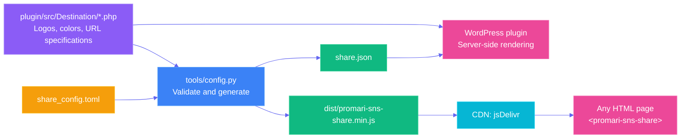
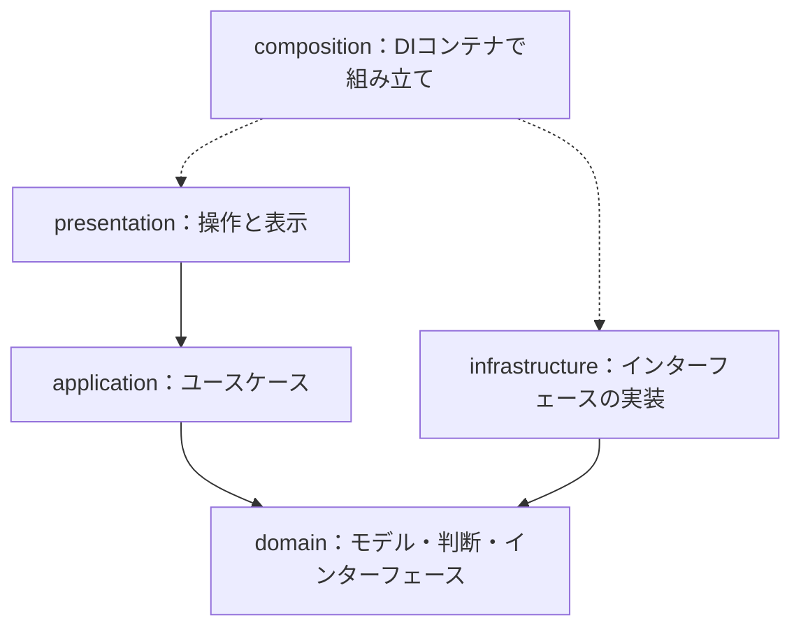

# Architecture

Three components share **one configuration source (TOML) and one destination
catalog (PHP destination classes)**.



## Two sources of truth

| Source | Location | Generated outputs |
|---|---|---|
| Configuration: what, where, and how to display | `share_config.toml` | `share.json` for the plugin; `generated/defaults.ts` for JavaScript |
| Destinations: SVG logos, brand colors, and where to send which fields | `plugin/src/Destination/*.php` | `generated/catalog.ts` for JavaScript |

The generator reads PHP classes with regular expressions and extracts `key()`,
`label()`, `brandColor()`, `icon()`, `action()`, `endpoint()`, and `params()`.
Those classes are definitions: they state where to send and which fields to send,
and are never loaded at runtime. **Share URLs are built in one place, the Web
Component.** PHP changes flow into JavaScript on the next build; `--check` detects drift.

## PHP plugin: layered architecture and SOLID

```text
plugin/
  promari-sns-share.php          Bootstrap: requires and the promari_sns_share() template tag
  src/Domain/Placement       Where the element may appear
  src/Contracts/             ConfigInterface (runtime), ShareDestinationInterface (definitions only)
  src/Config/JsonConfig      Reads generated configuration and fails closed
  src/Destination/               One final class per destination: logo, color, endpoint, and fields.
                             Read by tools/config.py; not loaded at runtime
  src/Integration/Widget     WordPress sidebar widget
  src/Plugin.php             Decides placement, emits <promari-sns-share>, loads the bundle
```

| Principle | Application |
|---|---|
| **S**: single responsibility | Separate configuration loading, URL construction, formatting, rendering, and wiring |
| **O**: open / closed | Add a `ShareDestinationInterface` implementation under `plugin/src/Destination/`; the generator picks it up at build time |
| **L**: substitution | Renderers rely on the six-method destination contract, not concrete destination classes |
| **I**: interface segregation | Themes use the template tag or shortcode without knowing renderer internals |
| **D**: dependency inversion | Rendering and formatting depend on `ConfigInterface`, not the JSON representation |

The plugin uses PHP 8.1 features: strict types, readonly properties, enums,
`match`, named arguments, first-class callables, and `array_map` / `array_filter`
pipelines.

## Web Components：レイヤード＋DDDの四層

共有URLの組み立ては、この四層だけが行う。PHP側は「どこへ、どの項目を送るか」を
定義として持ち、実行時にURLを作らない。2.0.0でサーバー描画を廃止したためで、
同じ処理を二か所に持たないぶん、両者の一致を確かめる必要もなくなった。

2.0.1で、依存の向きをレイヤードアーキテクチャとDDDの形へそろえた。
リポジトリと外部機能のインターフェースはdomainが持ち、infrastructureがそれを実装する。
そのためinfrastructureはdomainだけへ依存し、applicationを参照しない。

2.0.3で、各層の主役をクラスにそろえた。クラス・インターフェースは大文字始まり、
メソッドは小文字始まり、ファイル名はクラス名と同じにする（index.tsと生成物を除く）。
ユースケースは`execute()`、ドメインサービスは静的メソッド、infrastructureは
domainのインターフェースを`implements`するクラスとして書く。

3.0.0で、名前を役割と実装技術で読める形へそろえた。共有先は「サービス」ではなく
「シェア先（ShareDestination）」と呼び、公開設定・属性・イベントも同じ語にした。
infrastructureのクラスには`Gateway`を付けず、実装技術（Browser・InMemory・CustomEvent）を名前の先頭に置く。

3.1.0で、起動時の組み立てをDIコンテナ（InversifyJS 8）へ移した。四層のクラスはコンテナを知らず、
これまでどおりコンストラクタで依存を受け取る。デコレーターとreflect-metadataによる自動解決は使わず、
`TypedBinding.provide()`で「どのトークンを、どの順番で受け取るか」を書く。トークンは結び付く型を
持つため、取り違えはコンパイルエラーになる。クリックの通知先は要素ごとに違うので、ユースケースは
要素ごとに作るファクトリとして束縛する。テストはinfrastructureのモジュールだけを偽物に替える。

```text
web/src/
  domain/
    model/         値オブジェクト（ShareRequest・ShareDestination・SharedPage）と語彙
                   （ShareAction・Placement・ShareDestinationSpec・DestinationSelectionSettings・UtmSettings）
    service/       ドメインサービス（ShareActionPolicy・DestinationSelectionPolicy・ShareTextFormatter・
                   UtmParameterPolicy・UriEncoder）
    repository/    ShareDestinationRepository インターフェース
    gateway/       ClipboardGateway・NativeShareGateway・ShareWindowGateway・SharedPageGateway・
                   ShareActivityPublisher インターフェースと、それらをまとめた ShareGateways
  application/     ユースケース（BuildShareBarUseCase・HandleShareClickUseCase）、ShareButtonCatalog、ShareSettings
  infrastructure/  domainのインターフェースの実装（InMemoryShareDestinationRepository・BrowserClipboard・
                   BrowserNativeShare・BrowserPopupWindow・BrowserSharedPage・CustomEventShareActivityPublisher）
  presentation/    PromariSnsShareElement、ShareSettingsAttributeReader、ShareBarView・CircularShareBarView・
                   ShareBarStylesheet、FloatingBarVisibility、ToastNotifier、HtmlEscaper
  composition/     DIコンテナ（InversifyJS）の組み立て。四層の外に置き、具体的な実装を選んで
                   domainのインターフェースへ結び付ける唯一の場所（ShareContainer・InjectionTokens・TypedBinding）
  index.ts         入口。コンテナを作り、独自要素を登録する
  generated/       入力データ。index.tsから渡され、compositionが束縛する
```

| 依存元 | 許可する参照先 |
|---|---|
| domain | domain |
| application | application、domain |
| infrastructure | infrastructure、domain |
| presentation | presentation、application |
| composition | 四層すべてと`inversify`（外部パッケージを読み込めるのはここだけ） |
| index.ts | composition・presentation・生成入力（`inversify`もinfrastructureも直接は読まない） |



実線はソースの参照方向、点線は起動時の接続を表す。これは処理の実行順ではない。
コピーを実行するとき、処理はapplicationからinfrastructureの実装へ進むが、
applicationが知っているのはdomainの`ClipboardGateway`だけで、ブラウザの実装はimportしない。

クリックのユースケースは、画面へ何を出すかを決めない。`HandleShareClickUseCase.execute()`は
`copied`・`copy-fallback`・`shared`・`share-dismissed`・`popup`・`follow`のいずれかを返し、
presentationが結果に応じて画面内の通知を描く。書き込みの完了前に成功を名乗らない順序は、
戻り値を待つことで保つ。同じシェア先を複数置いても、表示層が操作ごとの識別子で押された要素を区別する。

PHPから抽出したシェア先の入力はapplicationの`ShareDestinationDefinition`で受け取る。
infrastructureの`InMemoryShareDestinationRepository`がURL規則だけを値オブジェクトにし、
applicationの`ShareButtonCatalog`が表示用メタデータを組み合わせる。
色・ロゴ・表示ラベルとCSSの設定型はdomainへ渡して保持しない。

属性の読み取りとスクロールに応じた表示は、独自要素そのものの入力と見た目なので
presentationに置く。infrastructureに残すのは、domainが必要とする外部機能の実装だけにする。

`tsconfig.core.json`はESの型だけを使い、DOMとNodeの型を外して内側の二層を検査する。
`architecture.test.ts`は型import・再exportを含む依存方向、動的読み込みによる迂回、
表示層への外部接続APIの混入、4層のファイル名が大文字始まりであることを検査する。infrastructureからapplicationへの参照のように、
意図的な違反を検出する対照テストも含む。

### Why four layers rather than MVVM?

MVVM is especially useful when a framework supplies automatic ViewModel-to-View
binding. Building that machinery for a mostly stateless Web Component would add
unnecessary complexity. The useful separation remains: `BuildShareBar` creates
a view model and `view.ts` renders it. A React or Vue wrapper can replace the
presentation layer without rewriting the domain logic.

### データと操作の流れ

1. index.tsが`ShareContainer.create()`でコンテナを作る。compositionがリポジトリとゲートウェイのブラウザ実装をdomainのインターフェースへ結び付け、ユースケースと組み合わせた依存を`PromariSnsShareElement.define()`へ渡す。
2. presentationが`AttributeConfigReader`で属性を設定として読み取り、`BuildShareBarUseCase.execute()`へ渡す。
3. `BuildShareBarUseCase`がdomainの選択・URL規則と表示用メタデータを合わせてビューモデルを返す。
4. presentationがShadow DOMへ描画し、クリックを`HandleShareClickUseCase.execute()`へ渡す。
5. `HandleShareClickUseCase`が`ClickPolicy.decide()`の判断を使い、ゲートウェイを呼んで結果を返す。操作の通知は
   ゲートウェイの実装がホスト要素からイベントとして送出し、画面内通知はpresentationが描く。

### Security and performance

- Analytics are exposed as events to the host page; the component does not send
  telemetry requests to a remote server.
- URL components are encoded and rendered HTML is escaped.
- Shadow DOM isolates component styles from host-page styles.
- The minified bundle is approximately 16 KB, has no runtime library dependencies,
  and is loaded as a deferred module.

## Generator: Python 3.13 and the standard library

`tools/config.py` uses frozen, slotted dataclasses, PEP 695 type parameters,
`StrEnum`, `match`, `pathlib`, and `tomllib`. It has no third-party Python
dependencies. Validation combines small pure helpers (`fields`, `ensure`,
`one_of`, and `within`); errors identify both the setting and the problem.
Writes use temporary files and `os.replace` for atomic replacement.

## Quality gates: `pnpm run verify`

| Check | Purpose |
|---|---|
| `tsc --noEmit` with strict, noUncheckedIndexedAccess, and exactOptionalPropertyTypes | Type consistency |
| `node --test` | URL・選択・設定・操作と、四層の依存境界・DOM型混入の対照テスト |
| Python `unittest` (9 tests) | TOML validation, fail-closed behavior, deployment / check convergence, and PHP catalog extraction |
| `render_test.php` (16 checks) | Configured HTML, CSS, and JavaScript rendering with WordPress-free stubs |
| `config.py --check` | Distribution files match regenerated outputs |

## ブラウザで公開契約を確認する

```bash
pnpm --filter @promari/sns-share build
python3 plugins/promari-sns-share/web/test-browser.py
```

PythonのPlaywrightとChromiumを用意した環境で実行する。1440 / 390 / 320pxで、
コピーの待機・拒否、端末共有の成功・拒否・未対応、いいねの状態反映、
再描画・再接続後の一回の通知、同じ共有先を複数置いた場合の通知先を確認する。
通信・クリップボード・保存の相手は制御し、本番サイトの票や解析へテスト操作を送らない。
